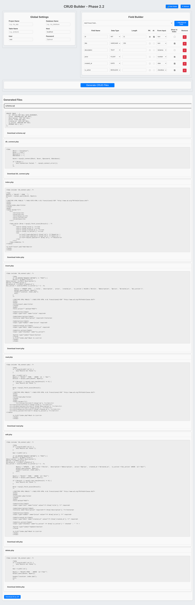

# CRUD Code Generator  
*A visual tool that generates full PHP CRUD apps with SQL schema & UI-ready forms.*

---

## ✅ Overview
**CRUD Code Generator** is a browser-based tool that lets you visually define a database table and instantly generate a full PHP CRUD application scaffold, including:

✅ SQL schema  
✅ PHP Insert / Read / Update / Delete pages with basic HTML layout  
✅ Database connection file  
✅ Auto-generated form fields based on your selections  
✅ ZIP export of all files  

No backend required — everything runs in the browser.

---

## ✨ Key Features

| Feature | Description |
|---------|------------|
✅ **Fully Browser-Based** | No server or installation needed  
💾 **Generates SQL schema automatically** | Ready for MySQL import  
📄 **Creates PHP CRUD pages** | Insert, Read, Edit, Delete  
🧱 **Includes styled HTML scaffolding** | Clean basic layout included in each file  
🎨 **Dark/Light Theme Support** | UI-wide theme toggle  
🧰 **Field builder UI** | Set name, type, PK, AI, nullable, input type  
📦 **Export as ZIP** | One click to download all generated files  
⚙️ **User-friendly interface** | Card-based modular layout  
🖱️ **One-click generation** | Define → Preview → Export  

---

## 🖥️ Live Demo (GitHub Pages)  
🚀 **Coming Soon:** `https://Functioneer.github.io/crud-code-generator/`  

---

## 📌 How It Works

1. Enter your **project and DB settings**
2. Add table fields via the **Field Builder**
3. Adjust field options (primary key, null, auto-increment, input type)
4. Click **Generate CRUD Files**
5. Preview generated code in expandable sections
6. Download individual files or **export full project as ZIP**
7. Import SQL schema into MySQL
8. Deploy CRUD app using PHP

---

## 📦 What Gets Generated

| File | Purpose |
|------|--------|
📄 `schema.sql` | Table definition for MySQL  
⚙️ `db_connect.php` | Reusable DB connection  
📥 `insert.php` | Form to add records  
📖 `read.php` | Display a single row  
✏️ `edit.php` | Form to update existing rows  
🗑 `delete.php` | Deletes a selected row  
📋 `index.php` | Table listing with actions  

✔ Each PHP file includes basic HTML for readability.

---

## 📂 Roadmap / Future Ideas (Optional Expansion)

✅ Multi-table support  
✅ Bootstrap / Tailwind UI style options  
✅ JSON/REST API generator  
✅ Form validation rules  
✅ Syntax highlighting in code preview  
✅ Multiple project saving via LocalStorage  

---

## 📜 License

This project is licensed under the **MIT License** — see the `LICENSE` file for details.

---

## 👨‍💻 Author

**Developed by Jim Bristol (@Functioneer)**  
Contributions, suggestions, and stars ⭐ are welcome!

---

